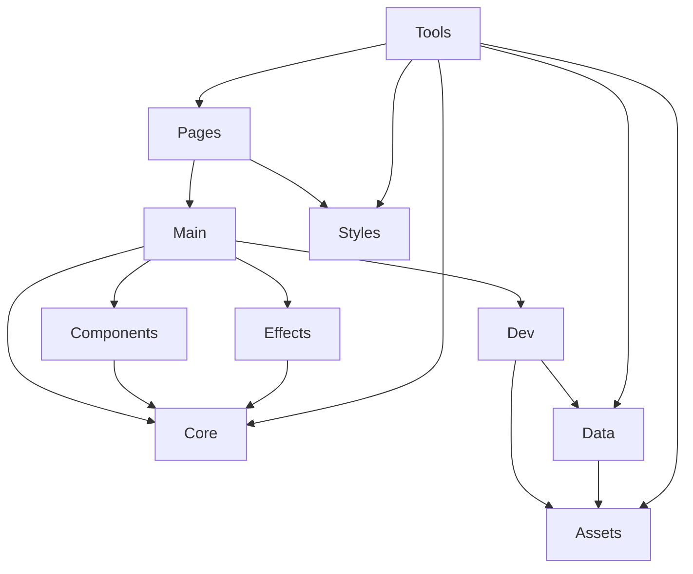

## 1. Stack
- Vanilla HTML/CSS/JS — no framework, no bundler, no build step (README.md; no package.json/go.mod/pyproject.toml/Cargo.toml in repo root)
- ES modules loaded directly by the browser, entry [[Main]] (index.html:422)
- Bash — tools/check-paths.sh, pre-push validation gate
- Node.js — tools/gen-markup.mjs, tools/sync-shell.mjs (authoring helpers; output is committed, never run at deploy time — README.md)
- Python — download_images.py + requirements.txt (one-off asset-fetch helper, not part of the served site)

## 2. Directory map
| path | what lives there |
|---|---|
| / | index.html, collection.html, lookbook.html, story.html, 404.html, README.md, sitemap.xml, robots.txt, .nojekyll |
| css/ | tokens.css, base.css, layout.css, components.css, sections.css, motion.css |
| js/ | main.js (entry point) |
| js/core/ | dom.js, nav.js, raf.js, reveal.js, store.js, bag.js, motion.js |
| js/components/ | card.js, drawer.js, filter.js, hanko.js, motion-toggle.js, preloader.js, quickview.js |
| js/effects/ | hero.js, byobu.js, flood.js, inkbasin.js, lookbook.js, shuchusen.js |
| js/data/ | products.js (single source of truth for product data) |
| js/dev/ | verify-data.js (localhost-only) |
| image/ | product photos (.webp), hero.mp4, logo, OG/Twitter images |
| font/ | anton-400.woff2, plex-mono-400/500.woff2, OFL license files |
| tools/ | check-paths.sh, gen-markup.mjs, sync-shell.mjs |

## 3. Diagram

## 4. Component index
- [[Pages]]
- [[Styles]]
- [[Main]]
- [[Core]]
- [[Components]]
- [[Effects]]
- [[Data]]
- [[Dev]]
- [[Tools]]
- [[Assets]]

## 5. Entry points
- Dev: `python3 -m http.server 8000`, open http://localhost:8000/ (README.md; `file://` fails, ES modules are blocked by CORS there)
- Prod: GitHub Pages project page, https://alphaman-0.github.io/zenji_shop/ (README.md)
- Bootstrap: `<script type="module" src="js/main.js">` (index.html:422)

## 6. Conventions
- Every path is relative, no leading `/`, except 404.html which must use absolute `/zenji_shop/` paths (README.md)
- Product image filenames are hand-authored, never templated/interpolated (js/data/products.js)
- CSS linked in a fixed cascade order: tokens → base → layout → components → sections → motion, motion.css last on purpose (index.html:30-35, README.md)
- Every module init in [[Main]] is wrapped in its own try/catch via a `run()` helper so one failure can't blank the page (js/main.js)
- Time/duration literals may only appear in css/tokens.css — enforced by tools/check-paths.sh gate 8
- One requestAnimationFrame loop only, in js/core/raf.js — don't add a second (README.md)

## 7. Where things go
- New product → edit js/data/products.js, then regenerate markup with tools/gen-markup.mjs (README.md)
- New page → add *.html at root, run tools/sync-shell.mjs to pull the canonical nav/footer from index.html (README.md)
- New effect → add a module to js/effects/, import + `run()` it in js/main.js, add any new duration token to css/tokens.css only
- New UI component → add a module to js/components/, wire it into js/main.js `boot()`, style it in css/components.css
- Before every push → run tools/check-paths.sh (README.md)
