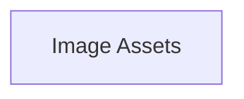

## Stack
No manifest (package.json/go.mod/pyproject.toml/Cargo.toml) exists at repo root. README.md states this is intended as a "ZENJI streetwear website | Next.js & React with Tailwind CSS" project, but no source code, config, or entry point files are present in the repository — only a README and an `image/` asset directory.

## Directory map
| path | what lives there |
|---|---|
| `/` | README.md, .gitignore |
| `image/` | Product/lookbook images (.webp), social preview images (opengraph-image.png, twitter-image.png), a hero video (hero.mp4), a hero poster (hero-poster.webp), a logo (wm_logo.webp) |

## Diagram

## Component index
- [[Image_Assets]]

## Entry points
- Dev: TODO: verify (no code or config present in repo)
- Prod: TODO: verify (no code or config present in repo)

## Conventions
- Image filenames use `Title-Case-With-Hyphens` plus a numeric suffix (e.g. `Blue-flame-4.webp`, `Warrior-spirit-5.webp`), observed in `image/`.
- Social-preview images follow platform-convention names: `opengraph-image.png`, `twitter-image.png` (observed in `image/`), consistent with Next.js metadata file conventions but no Next.js code confirms this.

## Where things go
- To add the actual application source, no existing structure dictates placement — repo currently has no `src/`, `app/`, or `pages/` directory to follow.
- To add or replace product imagery, touch: `image/` (follow existing `Title-Case-With-Hyphens-N.webp` naming).
- To update the hero video/poster, touch: `image/hero.mp4`, `image/hero-poster.webp`.
- To update social preview cards, touch: `image/opengraph-image.png`, `image/twitter-image.png`.
